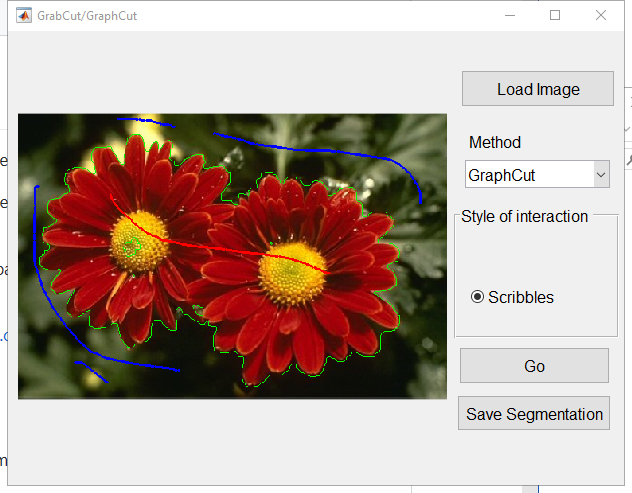

# GrabCut-GraphCut
Matlab implementation of GrabCut and GraphCut for interactive image segmentation.

GrabCut needs the user to provide a bounding box to segment an object. After getting an initial sgmentation, the user can provide scribbles for refinement.

GraphCut needs the user to provide a set of scribbles for the foreground and background to segment an object. Refinement is also allowed by giving more scribbles.

This repository uses the maxflow algorithm provided by http://vision.csd.uwo.ca/code/

This implementation was developed for comparison with DeepIGeoS. If you use this repository, please cite the following paper:

Wang, Guotai, et al. "Deepigeos: A deep interactive geodesic framework for medical image segmentation."  IEEE Transactions on Pattern Analysis and Machine Intelligence, 2018. https://ieeexplore.ieee.org/document/8370732

# How to use:

1, download the code

2, go to the folder "Algorithms", run make.m to compile the maxflow algoithm.

3, run user_interface.m and load an image, start to segment!

A snapshot for GraphCut.

A snapshot for GrabCut.

# Reference

[1] Boykov, Yuri Y., and M-P. Jolly. "Interactive graph cuts for optimal boundary & region segmentation of objects in ND images." Computer Vision, 2001. ICCV 2001. Proceedings. Eighth IEEE International Conference on. Vol. 1. IEEE, 2001.

[2] Rother, Carsten, Vladimir Kolmogorov, and Andrew Blake. "Grabcut: Interactive foreground extraction using iterated graph cuts." ACM transactions on graphics (TOG). Vol. 23. No. 3. ACM, 2004.
